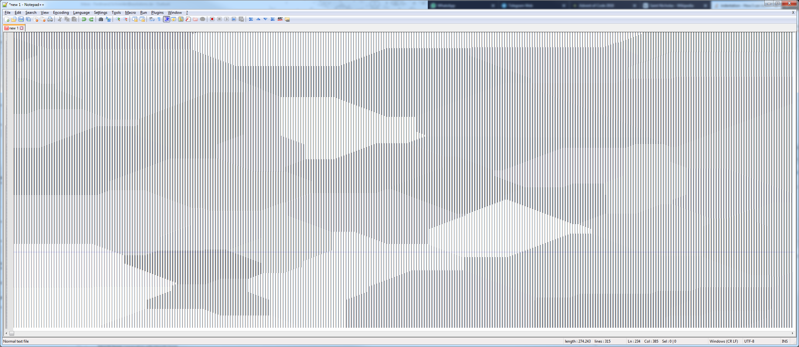

# Advent of Code 2018
Here you can find my solutions for Advent of Code 2018: https://adventofcode.com/2018.

The solutions are written in a language I wasn't very familiar with before: TypeScript.

# Structure
You can find my solutions in separate folders named by the date.
E.g. day_01 was the day 1 puzzle of the challenge.
Under each folder there are three files:
* the solution for part 1 of the day: day_01_1.ts
* the solution for part 2 of the day: day_01_2.ts
* the test-spec to run my puzzle solutions for both parts of the day: day_01.spec.ts

# Improvement suggestions
You are cordially invited to send me suggestions for improvements or comments as a pull request so that we together can improve our TypeScript skills :) .

# Run tests
`npm test`

# Solution remarks etc.
## Graphical representation of solution on day 6, part 1
I found this very nice so i wanted to share it with you :) :

It is an ascii representation of the grid. The different shaded areas represent all coordinates with the 
shortest distance to a location within it.